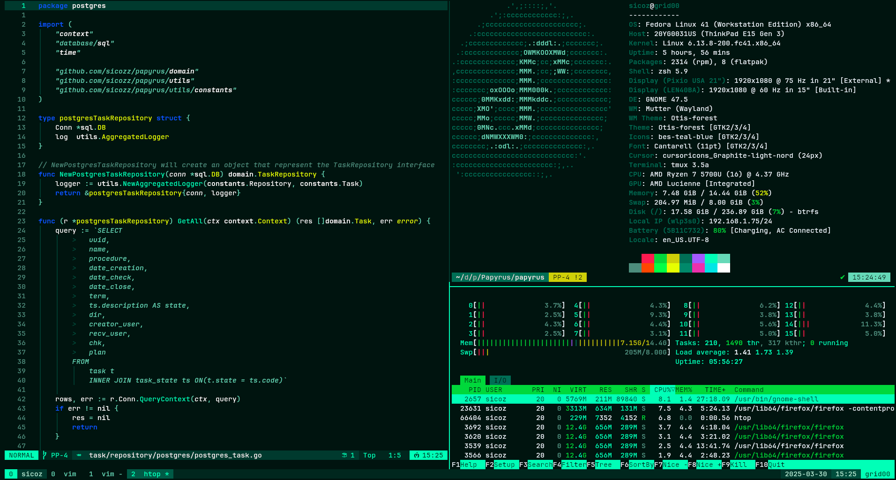

# Conqueror.nvim

A cyberpunk-inspired Neovim color scheme with a monochromatic teal foundation and vibrant accent colors.



## Features

- 🌈 Cyberpunk aesthetic with a focus on readability
- 🌙 Dark monochromatic teal base with carefully selected accent colors
- 🔌 Plugin-specific highlighting for a cohesive experience
- 🔄 True color terminal support
- 🖥️ Transparent background option
- Highly customizable with extensive configuration options

## Installation

### Using [packer.nvim](https://github.com/wbthomason/packer.nvim)

```lua
use {
  "sicozz/conqueror.nvim",
  config = function()
    -- Optional: configure the color scheme
    require("conqueror").setup({
      -- your configuration options here
    })

    -- Set the colorscheme
    vim.cmd("colorscheme conqueror")
  end
}
```

### Using [lazy.nvim](https://github.com/folke/lazy.nvim)

```lua
{
  "sicozz/conqueror.nvim",
  lazy = false,
  priority = 1000,
  opts = {
    -- your configuration options here
  },
  config = function(_, opts)
    require("conqueror").setup(opts)
    vim.cmd("colorscheme conqueror")
  end,
}
```

## Configuration

Conqueror.nvim comes with the following default settings:

```lua
{
  terminal_colors = true,     -- Set terminal colors
  undercurl = true,           -- Enable undercurl for diagnostics
  underline = true,           -- Enable underline for certain highlights
  bold = true,                -- Enable bold for certain highlights
  italic = {
    strings = true,           -- Italic strings
    emphasis = true,          -- Italic for emphasis (markdown, etc.)
    comments = true,          -- Italic comments
    operators = false,        -- Italic operators
    folds = true,             -- Italic folds
  },
  strikethrough = true,       -- Enable strikethrough for struck content
  invert_selection = false,   -- Invert the visual selection
  invert_signs = false,       -- Invert gutter signs
  invert_tabline = false,     -- Invert the tabline highlights
  invert_intend_guides = false, -- Invert indent guides
  inverse = true,             -- Use inverse highlight for certain elements
  transparent_mode = false,   -- Enable transparency
  dim_inactive = false,       -- Dim inactive windows

  -- Override specific colors in the palette
  palette_overrides = {
    -- Example: Override the red color
    -- accent_tertiary = "#ff0000",
  },

  -- Override specific highlight groups
  overrides = {
    -- Example: Make comments more visible
    -- Comment = { fg = "#ffffff", italic = true },
  },
}
```

## Color Palette

### Main Colors

- **Base Background**: #00271e - "Deep Abyss" (dark teal background)
- **Lighter Background**: #003a2e - "Circuit Void" (UI elements, panels)
- **Selection Background**: #005a46 - "Neon Pulse" (selected text/items)
- **Foreground Primary**: #b3f0d8 - "Terminal Glow" (main text color)
- **Foreground Secondary**: #66d9b8 - "Data Stream" (secondary text)

### Accent Colors

- **Accent Primary**: #00ffb7 - "Cyberlink" (primary accent for highlights)
- **Accent Secondary**: #e6ff00 - "Voltage" (warnings, important elements)
- **Accent Tertiary**: #ff1a4f - "Neural Flare" (errors, critical elements)
- **Accent Quaternary**: #a359ff - "Quantum Shift" (special elements)
- **Accent Quinary**: #0d56ff - "Hologram Blue" (links, information)

## Plugin Support

Conqueror.nvim provides enhanced highlighting for:

- LSP & Diagnostics
- Treesitter
- NvimTree
- Telescope
- Git signs/diffs
- nvim-cmp
- Markdown
- Which-key
- and many more...

## Contributing

Contributions are welcome! Feel free to open issues or pull requests if you have suggestions, improvements, or bug fixes.

## License

Conqueror.nvim is released under the MIT License. See the [LICENSE](LICENSE) file for more details.

This means you can use, modify, and distribute this color scheme freely, even in commercial projects. The only requirement is that you include the original copyright notice and license text.
